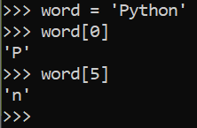

# Instalasi dan Penggunaan _Interpreter_ Python

## Bab 1 Tentang Python

Python adalah bahasa pemrograman interpretatif multiguna. Tidak seperti bahasa lain yang susah untuk dibaca dan dipahami, python lebih menekankan pada keterbacaan kode agar lebih mudah untuk memahami sintaks.

Python memungkinkan anda untuk membagi program Anda menjadi modul yang dapat digunakan kembali dalam program Python lainnya.

Python memungkinkan program ditulis dengan ringkas dan mudah dibaca. Program yang ditulis dengan Python biasanya jauh lebih pendek daripada program C, C++, atau Java yang setara, karena beberapa alasan : 
- Tipe data tingkat tinggi memungkinkan Anda untuk mengekspresikan operasi kompleks dalam satu pernyataan
- Pengelompokan pernyataan dilakukan dengan indentasi alih-alih tanda kurung awal dan akhir
- Tidak diperlukan deklarasi variabel atau argumen

## Bab 2 Menggunakan Python Interpreter

Berikut langkah-langkah menggunakan _python interpreter_ : 

1. Buka terminal CMD dan ketikkan perintah berikut untuk masuk ke python interpreter

```python```


2. Untuk mencobanya ketikkan perintah berikut

```the_world_is_flat = True``` 

```if the_world_is_flat :```

```print("Be careful not to fall off!")```


## Bab 3 Pengantar Informal Python

### 3.1 Menggunakan Python dalam Perhitungan

Pada interpreter python kita dapat mengetikkan sebuah perhitungan sederhana hingga aritmatika.

#### 3.1.1 Numbers

Pada python dapat mengetikkan ekspresi dengan memasukkan operator seperti **+, -, * dan /**


Untuk pembagian yang menginginkan hasil bilangan bulat dapat menggunakan **//**


Dapat juga menggunakan pangkat dengan operator _**_


Tanda sama dengan ( =) digunakan untuk memberikan nilai pada variabel


Jika suatu variabel tidak "didefinisikan" (diberi nilai), maka akan terjadi kesalahan


Mendukung floating point tipe dengan operator campuran


Hasil terakhir yang dikerjakan pada python bisa di panggil kembali menggunakan variabel **_** 


Variabel tersebut tidak boleh di tetapkan atau di deklarasikan.

#### 3.1.2 String

Selain angka, Python juga dapat memanipulasi string, yang dapat diekspresikan dalam beberapa cara. Mereka dapat diapit oleh tanda kutip tunggal ('...') atau tanda kutip ganda ("...") dengan hasil yang sama. \ dapat digunakan untuk menghindari kutipan.


Fungsi **print()** menghasilkan output yang lebih mudah dibaca, dengan menghilangkan tanda kutip dan dengan mencetak karakter khusus.


Menambahkan **r** sebelum tanda kutip pertama akan membuat \ bukan sebagai karakter khusus.


String dapat digabungkan  dengan operator, dan diulang dengan *


Jika terdapat 2 atu lebih literal string di samping satu sama lain maka otomatis digabungkan.


Jika nilai sebuah variabel sangat panjang anda dapat memisahkannya menggunakan '...'


Hanya berfungsi dengan dua literal, tidak dengan variabel atau ekspresi.


Jika ingin menggabungkan variabel  dan literal, dapat menggunakan **+**


String dapat diindeks, dengan karakter pertama memiliki indeks 0.



Indexs pada python juga bisa berupa angka negatif.


Selain pengindexsan, python juga di dukung dengan pengirisan untuk mendapatkan substring.


Indexs irisan memiliki default untuk menghilangkan nol.


Salah satu cara untuk mengingat irisan adalah dengan menganggap indeks sebagai penunjuk antar karakter, dengan tepi kiri karakter pertama bernomor 0. Kemudian tepi kanan karakter terakhir dari string n karakter memiliki indeks n.


Jika memasukkan indexs yang terlalu besar akan menyebabkan kesalahan


Namun indexs irisan yang di luar batasan dapat di tangani menggunakan


String Python tidak dapat diubah. Apabila string di tetapkan ke posisi yang diindeks maka akan terjadi kesalahan.


Jika membutuhkan string yang beda maka harus di buat baru.


Fungsi len() akan mengembalikan panjang string.


#### 3.1.3 List

Python mengetahui sejumlah tipe data gabungan , yang digunakan untuk mengelompokkan nilai-nilai yang lain. Yang paling serbaguna adalah list , yang dapat ditulis sebagai daftar nilai (item) yang dipisahkan koma di antara tanda kurung siku.


List dapat diindeks dan diiris.


Semua operasi irisan akan mengembalikan list baru yang berisi elemen yang diminta.


Juga mendukung operasi penggabungan.


Tidak seperti string, yang tidak dapat diubah , daftar adalah jenis yang dapat diubah , yaitu kontennya dapat diubah.


Juga dapat menambahkan item baru di akhir daftar, dengan menggunakan append().


Penetapan irisan juga memungkinkan, bahkan dapat mengubah ukuran daftar atau menghapus seluruhnya.


Fungsi len() bawaan juga berlaku untuk list.


Memungkinkan untuk membuat daftar bersarang (daftar di dalam daftar lainnya).


### 3.2 Langkah awal programming menggunakan python

Kita dapat menggunakan Python untuk tugas yang lebih rumit daripada menambahkan dua dan dua secara bersamaan. Misalnya, kita dapat menulis sub-urutan awal dari deret Fibonacci sebagai berikut : 


Contoh tersebut memiliki beberapa fotur baru :
- Baris pertama berisi beberapa penugasan : variabel adan b secara bersamaan mendapatkan nilai baru 0 dan 1. Pada baris terakhir ini digunakan lagi, menunjukkan bahwa ekspresi di sisi kanan semuanya dievaluasi terlebih dahulu sebelum penugasan dilakukan . Ekspresi sisi kanan dievaluasi dari kiri ke kanan.
- Loop whiledijalankan selama kondisi (di sini: ) tetap benar. 
- Body loop indented : indented adalah cara Python mengelompokkan pernyataan.
- Fungsi print()menulis nilai argumen yang diberikan.


_End_ dapat digunakan untuk menghindari baris baru setelah output atau mengakhiri output dengan string yang berbeda.

